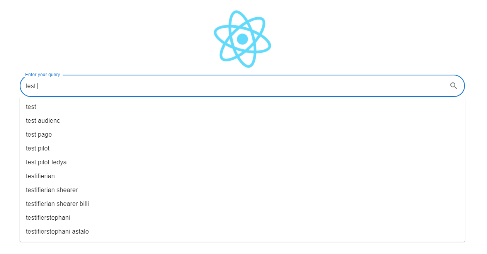

# Simple Search Engine UI

## Installation

NodeJS: version 16.15.1  

## Getting started

1. `npm install` to install the dependencies
2. `npm start` to run the UI
3. Open [http://localhost:3000](http://localhost:3000) to view it in your browser.

[Optional]  
The api endpoint could be modified in [axiosConfig.js](src/api/axiosConfig.js)

## Crawler

Click the React icon and a dialog will be shown.  
Specify seed url and number of pages to crawl and submit the form.

## Search Bar

Enter the query to search and click enter or submit icon to search top 50 relevant pages indexed.

## Prefix Truncation

The query recommendations list will be shown when the query is being typed.  

