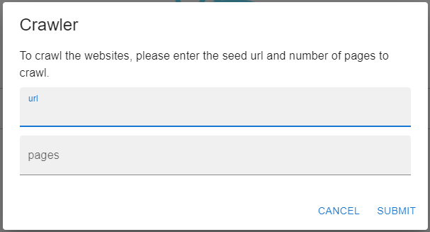
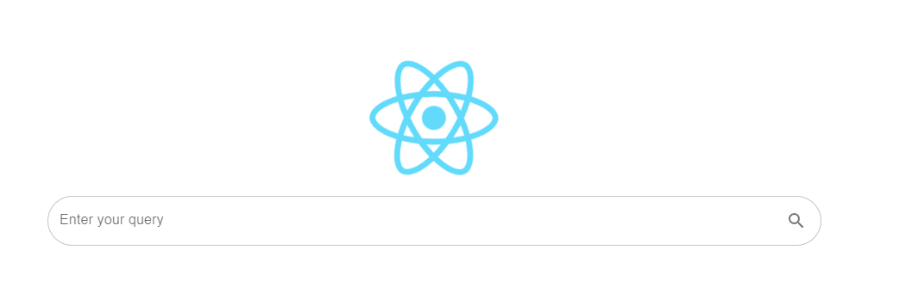
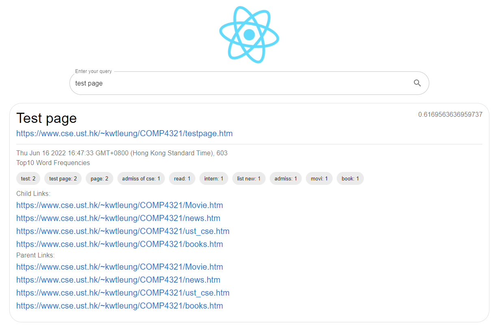

# Simple Search Engine UI

## Getting started

Run `npm start` in the development mode.  
Open [http://localhost:3000](http://localhost:3000) to view it in your browser.

## Crawler

Click the React icon and a dialog will be shown.  
Specify seed url and number of pages to crawl and submit the form.

## Search Bar

Enter the query to search and click enter or submit icon to search top 50 relevant pages indexed.

