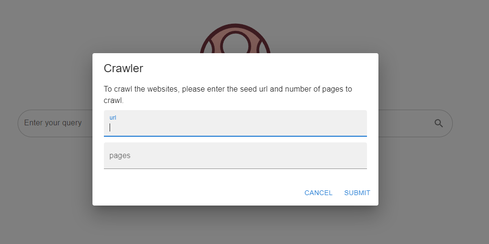
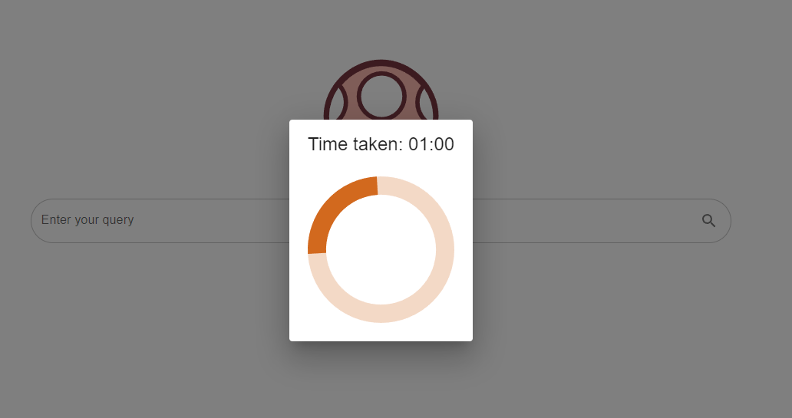
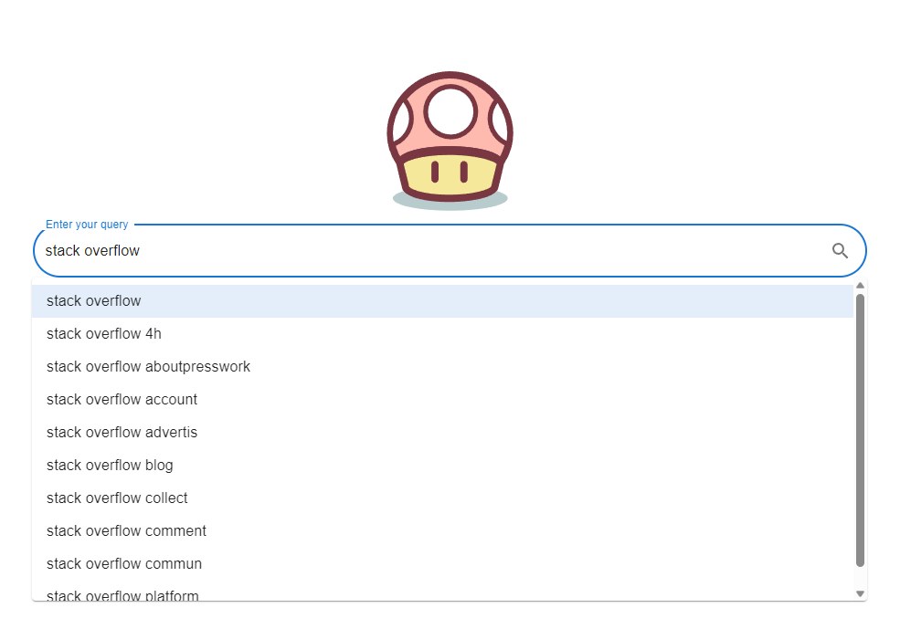
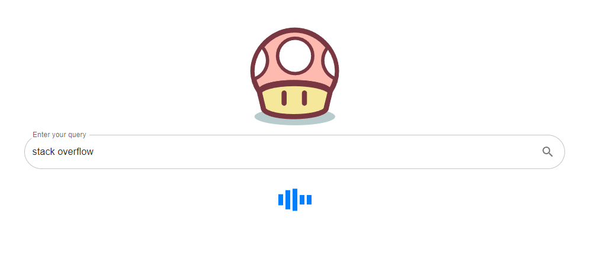

# Simple Search Engine UI

## Installation

node: version 18.16.0
npm: version 9.5.1

## Getting started

1. `npm ci` to install the dependencies
2. `npm start` to run the UI
3. Open [http://localhost:3000](http://localhost:3000) to view it in your browser.

[Optional]  
The api endpoint could be modified in [axiosConfig.js](src/api/axiosConfig.js)

### Crawler form:

### Crawling:

### Query recommendation:

### Searching:

### Results page:

